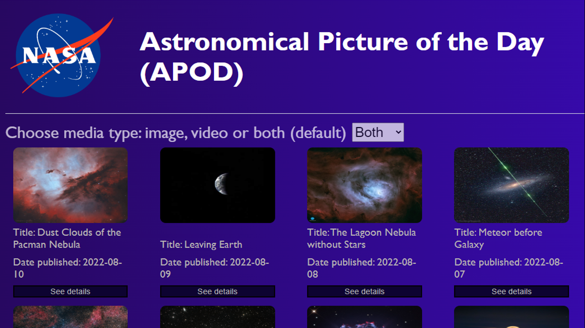

# Project Name: Capstone APOD

Project for React & Redux individual capstone assignment.

The Astronomical Picture of the Day (APOD) app consists of the daily "picture of the day" image or video, provided by the National Space Agency (NASA) of the United States via its api site { NASA api's }. It's an official website of the goverment of USA, and can be visited at the following link:
https://api.nasa.gov/

The APOD app shows a collection of the last 30 images provided by the NASA api. Everyday, at midnight USA eastern standard time (USA East Coast time), a new pictured is added to the collection.

The pictures rendered by the app include images and videos. The app provides the user with a select option, to show a separated list of images or pictures. By default, the app shows the combined list of images and videos, under de option "Both".

Under each image or video displayed there's a button that let the user navigate to a new section containing the complete information provided by the api about the selected image or video.

This information includes the following items:
- Title
- Author (if available)
- Date published (YYYY-MM-DD format)
- Explanation
- Media service
- Service code

The APOD app has been built with React and Redux / Redux Toolkit.

## Requirements:

Project will be build according to the following guidelines:

Use React documentation.
Use React components.
Use React props.
Use React Router.
Connect React and Redux.
Handle events in a React app.
Write unit tests with React Testing Library.
Use styles in a React app.
Use React life cycle methods.
Apply React best practices and language style guides in code.
Use store, actions and reducers in React.

## Built With:
Major languages: Javascript, HTML, CSS
Frameworks: webpack, Jest, React, Redux, Redux Toolkit
Technologies used: VSC, Github, Gitflow

## App home page image:

## Getting Started:
Clone the repository in your local machine using git clone.

Please run: npm run build and then npm start to see project displayed in your browser.

## Live demo:

To see the project deployed please visit anyone of the following links:

not available

##  Authors
👤 Author1

- Dario Alessio

- GitHub: https://github.com/DarioAlessioR

- Slack: https://microverse-students.slack.com/team/U039GCFRK9B

- LinkedIn: https://www.linkedin.com/in/dario-alessio-3a3b7911b

## 🤝 Contributing:

Contributions, issues, and feature requests are welcome!

Feel free to check the [issues page](../../issues/).

## Show your support:

Give a ⭐️ if you like this project!

## Acknowledgments

- To the NASA for providing the images and videos, as well as the scientific information of each picture.
- Hat tip to anyone whose code was used
- Inspiration

## 📝 License

This project is [MIT](./MIT.md) licensed.